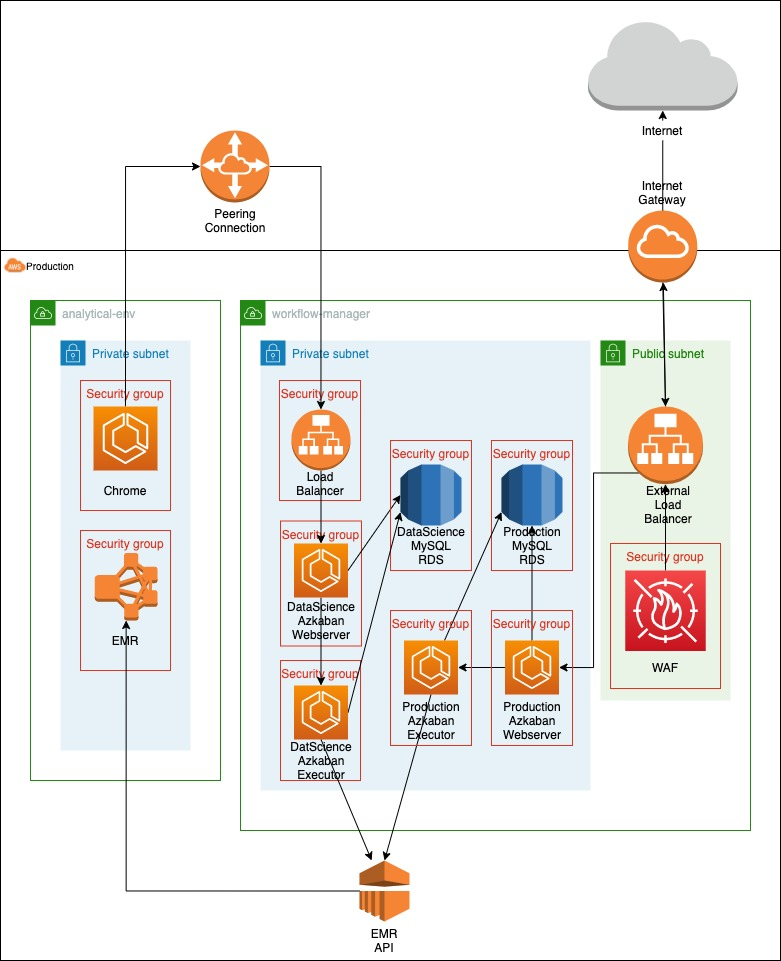

# aws-azkaban

## An AWS based azkaban platform

## Description
AWS Azkaban deploys two containerised versions of [Azkaban](https://azkaban.github.io/azkaban/docs/latest/) that both back onto an AWS EMR cluster along with the peripheral infrastructure required for functionality and security. 
One of the versions is for users through the Analytical Env and the other for use by admins and engineers (referred to as azkaban_external), that is accessible directly through a URL. 
The frontend of the service is handled by the webserver containers from which, tasks are sent to and then handled by the executors. An Aurora Serverless database is used to track active executors that can be called by the webservers when needed.

## Development
This repo contains only the IAC and lambdas and these can be developed as they are found. The Azkaban containers themselves can be found [here](https://github.com/dwp/dataworks-hardened-images) along with further documentation on them. 
The containers are pushed to ECR and called by name by the infrastructure in this repo.

The deployment is handled using a Concourse [job](https://ci.dataworks.dwp.gov.uk/teams/dataworks/pipelines/aws-azkaban) and the pipeline code can be found in the `/ci` directory. There are admin ci jobs for cycling the containers and rotating passwords.

## Lambda's
There are 3 lambdas in this repo that carry out administrative tasks:

**1. azkaban-truncate-table:**
Used to truncate the active executors table to ensure no inactive executors are called upon redeployment of the service.

**2. azkaban-zip-uploader:**
Used to upload .zip files containing Azkaban projects from AWS S3. The lambda is triggered by a `*.success` file being uploaded to a dir in the given S3 and is used to safely access the Azkaban API from within the VPC.

**3. manage-azkaban-mysql-user**
Used to rotate the credentials used to access the Aurora Serverless DB that is mentioned above.

## Access

Production Azkaban can be found [here](https://azkaban-external.dataworks.dwp.gov.uk/). 

Other envs:
[Dev](https://azkaban-external.dev.wip.dataworks.dwp.gov.uk)
[QA](https://azkaban-external.qa.wip.dataworks.dwp.gov.uk)
[INT](https://azkaban-external.int.wip.dataworks.dwp.gov.uk)
[PreProd](https://azkaban-external.pre.dataworks.dwp.gov.uk)


## Authentication
Currently two instances of Azkaban are deployed. `user` and `external`. They use differing authentication methods. External uses cognito.
In order to accommodate programmatic access to Azkaban external, a cognito user was created. The details are stored in the `../azkaban_external/cognito` secret.
In order to accommodate programmatic access to Azkaban user, a traditional user is created. The details are stored in the `../workflow_manager` secret.

Access to user azkaban via the Analytical Env is managed by rbac 2 roles in the batch security config on the batch cluster and jobs are run as the user that triggered them.
Access to external azkaban is managed by the concourse cognito userpool and jobs run in external azkaban are run as a service user.
These settings are toggled in the `config/*.properties` files and controlled by the extensions mentioned below.

### Requirements

* Terraform 0.14
* Python 3
* JQ
* Access to Dataworks AWS Environments

### Bootstrapping

Before beginning you will need to generate some Terraform files from templates, to do this you will need to simply run the following:
```bash
make bootstrap
```

You will then be able to develop against the development account (default Terraform workspace)

## Azkaban Extensions

**CognitoUserManager** - An extension to the XML UserManager that can also receive a Cognito JSON Web Token. The user manager decodes and validates the token and from this information is able to authenticate the user.

**CognitoUserManagerProxy** - An extension which validates a users name and password against an existing Cognito User Pool using USER_SRP_AUTH type authentication. The pool details are stored in the webservers azkaban.properties

**EMR JobType** - A job type that extends the process job type and can receive the script and arguments that need to be submitted to the cluster. Ensures the correct group that it needs to be run as is submitted along with the script.

## Monitoring
Currently, only external azkaban is being monitored in dev, preprod and prod environments. This is configured as aws_cloudwatch_metric_alarms in the external_monitoring.tf file.
The active alerts are for mismatches in desired task counts and running task counts for the webservers and executors and 500 errors in the frontend. 
When triggered these alerts are sent to the `dataworks-aws-service-alerts` slack channel.

## High level infrastructure outline




## Monitoring Canary
There exists a monitoring project on Azkaban which runs every 10 minutes - called 'monitoring'. This task acts as a canary.
If the canary succeeds, it will print 'Hello World' into the executor log files. Cloudwatch is monitoring for this log and when it finds it, it will record '1' against the 'azkaban-external-monitoring-canary-success' metric.

An alarm exists which will check that the 'azkaban-external-monitoring-canary-success' metric has a datapoint of value 1 or above every 15 minutes; if it doesn't it will raise an alert.

### Schedule of Monitoring Canary
In the event that schedules are lost on Azkaban, you must set the schedule of the monitoring canary manually as it requires the {user.to.proxy} value to be that of a valid Azkaban user. (Find this user in the Azkaban executor logs)
This parameter is not yet supported in the azkaban-job-scheduler lambda.
